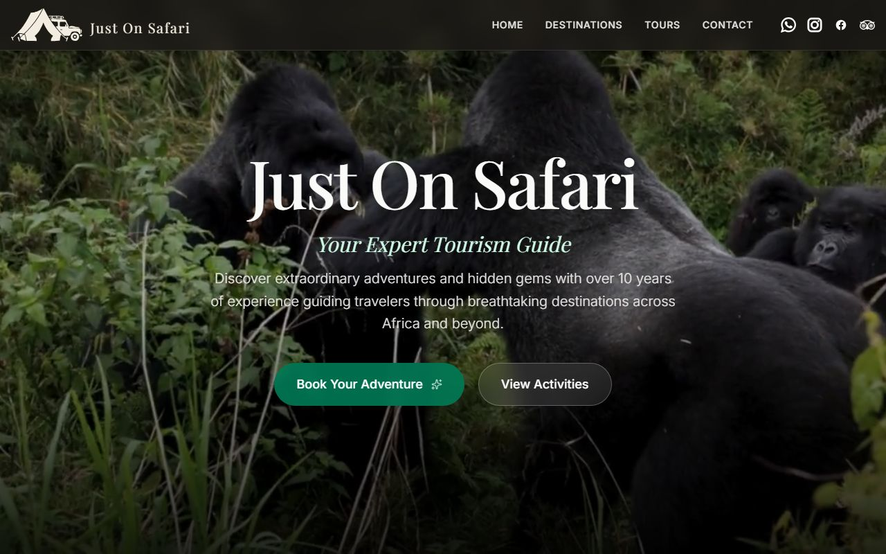
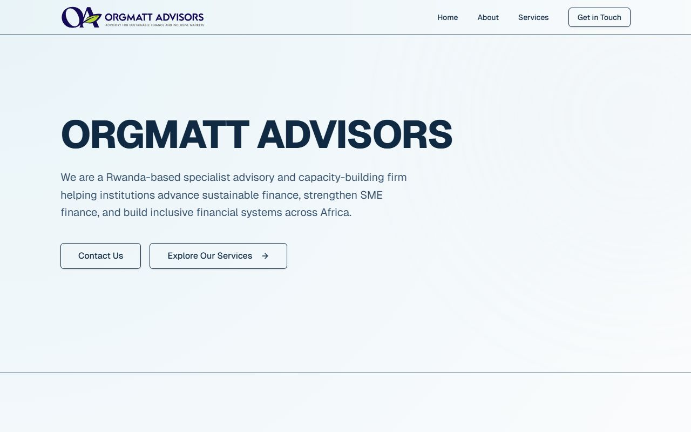
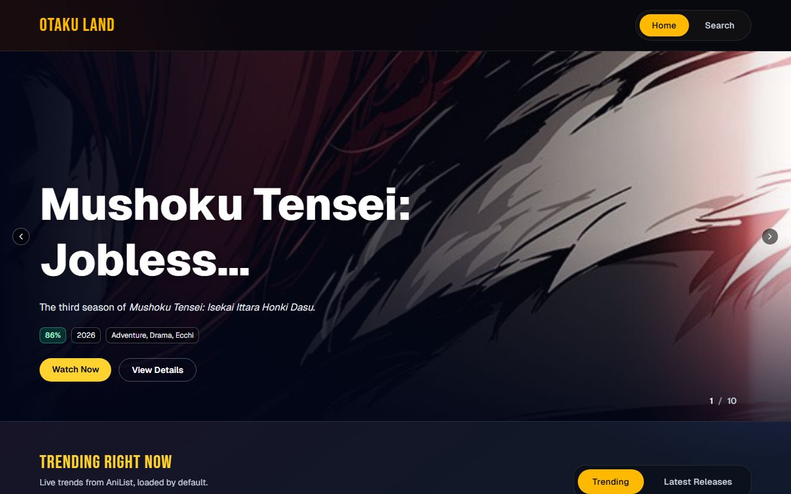
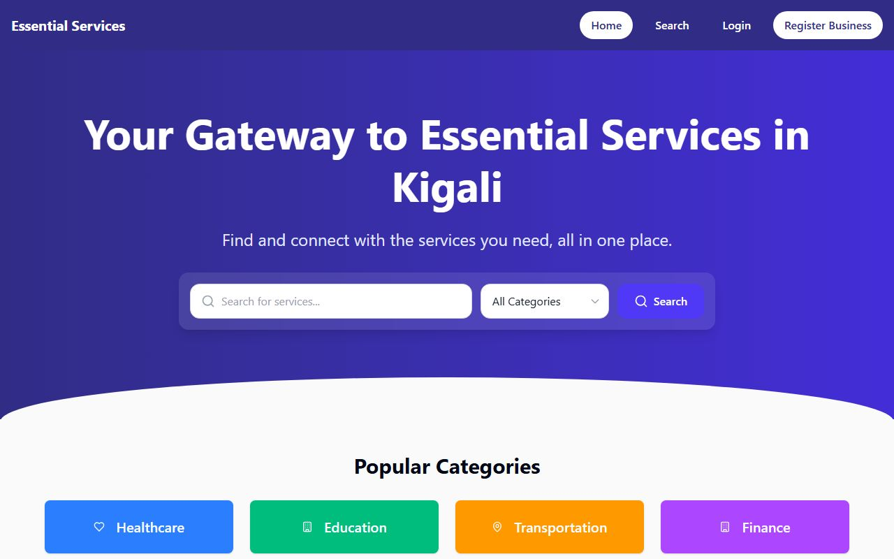
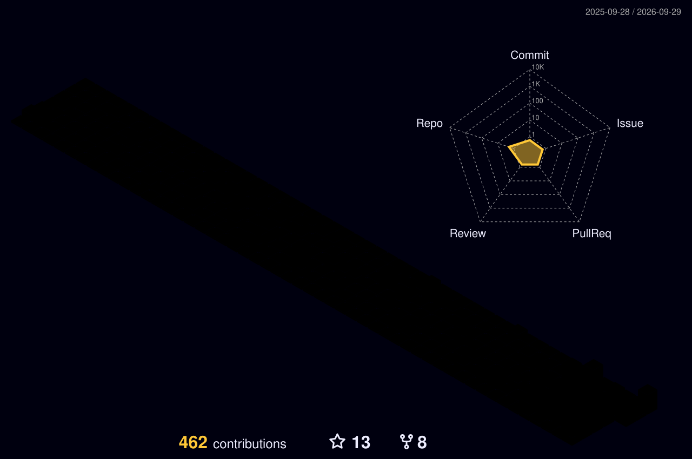

<picture>
  <source media="(prefers-color-scheme: dark)" srcset="assets/banner-dark.svg" />
  <source media="(prefers-color-scheme: light)" srcset="assets/banner-light.svg" />
  
</picture>

  
  
  

## 👋 About me

I'm a full-stack engineer in Kigali who likes owning a product from the database schema to the last pixel.

- 🛠️ By day I build internal web tools and data-visualisation apps
- 🌍 On the side I ship production websites for businesses in Rwanda
- 🧪 Currently exploring event-driven backends with NestJS, RabbitMQ and Redis
- 🎌 Huge anime fan, which is why [Otaku Land](https://otaku-site-boris.vercel.app) exists

## 🚀 Featured work

<table>
  <tr>
    <td width="50%" valign="top">
      
      <h3><a href="https://justonsafari.com">Just On Safari</a></h3>
      
Production site for a Rwandan tour company: tour packages, destination guides and an enquiry flow that emails the owner and the traveller.

      

        
        
        
        
      

    </td>
    <td width="50%" valign="top">
      
      <h3><a href="https://orgmatt.vercel.app">Orgmatt Advisors</a></h3>
      
Fast static site for a sustainable-finance advisory firm, built with content-first pages and zero-JS-by-default islands.

      

        
        
        
        
      

    </td>
  </tr>
  <tr>
    <td width="50%" valign="top">
      
      <h3><a href="https://otaku-site-boris.vercel.app">Otaku Land</a></h3>
      
Anime discovery site with trending shows and search, powered by live data from the AniList GraphQL API.

      

        
        
        
      

    </td>
    <td width="50%" valign="top">
      
      <h3><a href="https://github.com/boris-ny/alu-capstone-essential_services">Essential Services</a></h3>
      
Directory that helps people in Kigali find healthcare, education, transport and finance services on a map, with business sign-up. My university capstone.

      

        
        
        
      

    </td>
  </tr>
</table>

## 🧰 Tech I use

  
   
  

## 📈 Activity

<picture>
  <source media="(prefers-color-scheme: dark)" srcset="https://raw.githubusercontent.com/boris-ny/boris-ny/output/github-snake-dark.svg" />
  <source media="(prefers-color-scheme: light)" srcset="https://raw.githubusercontent.com/boris-ny/boris-ny/output/github-snake.svg" />
  
</picture>

<picture>
  <source media="(prefers-color-scheme: dark)" srcset="profile-3d-contrib/profile-night-rainbow.svg" />
  <source media="(prefers-color-scheme: light)" srcset="profile-3d-contrib/profile-green-animate.svg" />
  
</picture>

  

